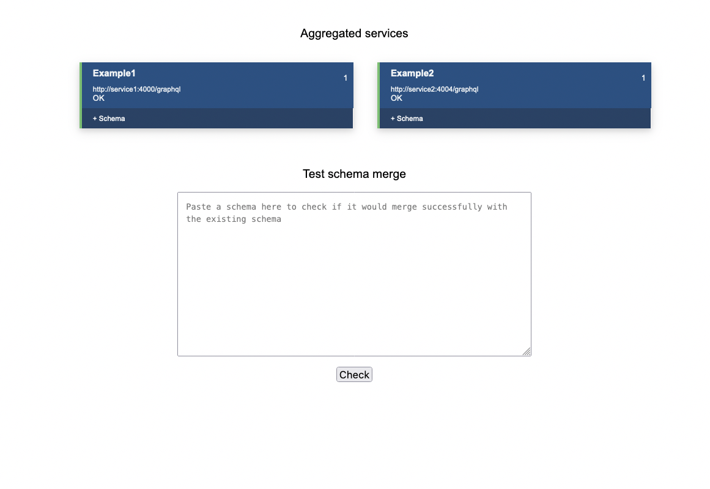
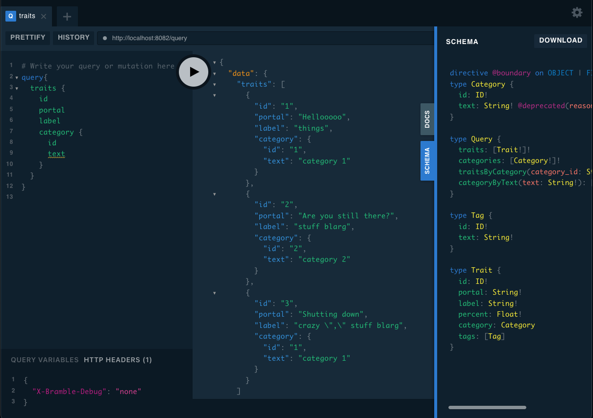
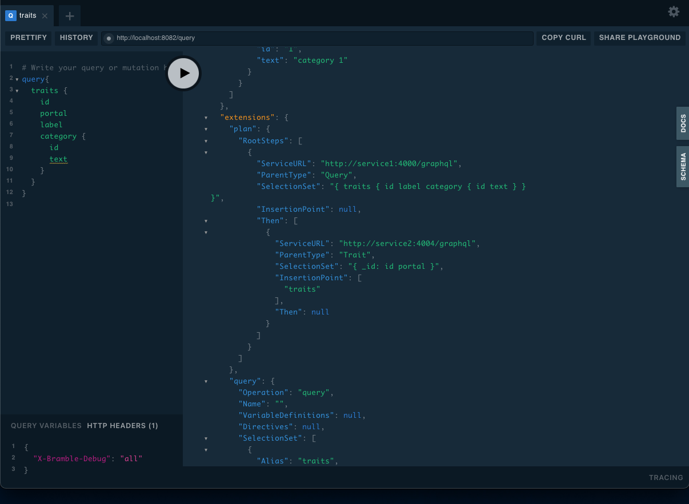

# Bramble Spike with Two Fake Services

## Building Docker

You'll need to `Docker build` the Bramble and Graphql-Spiker sub folders. If you're on a Mac or Linux you can use the `Makefiles` (if you are on windows, look inside the Makefile and run the commands from within the `build` task by hand):

```shell
$ cd bramble
$ make build
```

**Note:** that with Bramble you might need to change the `ARCH` variable so that bramble is compiled for the correct architecture.

```shell
$ cd graphql-spiker
$ make build
```

Once this is done, you should have two images, one for Bramble and one for Graphql-Spiker:

```shell
be-chapter-graphql-federation main 🦉> docker images
REPOSITORY       TAG       IMAGE ID       CREATED       SIZE
bramble          latest    0c031615c75a   2 hours ago   17.7MB
graphql-spiker   latest    3b61a023e082   2 hours ago   134MB
```

## Running Docker Compose

From there you should be able to run the docker-compose file in the root of the project:

**Note:** you might have to change the `platform` settings in the `docker-compose.yml` file because it is again setup for an M1 Mac.

```shell
be-chapter-graphql-federation main 🦉> docker compose up
[+] Running 3/0
 ⠿ Container be-chapter-graphql-federation_service2_1  Created                      0.0s
 ⠿ Container be-chapter-graphql-federation_service1_1  Created                      0.0s
 ⠿ Container be-chapter-graphql-federation_bramble_1   Created                      0.0s
Attaching to bramble_1, service1_1, service2_1
service2_1  | 1633306907871 Scanning repository example2...
...
service1_1  | 1633306907873 Scanning repository example...
...
bramble_1   | {"level":"info","msg":"service was upgraded","service":"","time":"2021-10-04T00:21:48.519444882Z","url":"http://service1:4000/graphql","version":""}
...
bramble_1   | {"level":"info","msg":"service was upgraded","service":"","time":"2021-10-04T00:21:48.534017882Z","url":"http://service2:4004/graphql","version":""}
...
bramble_1   | {"level":"info","msg":"rebuilding merged schema","time":"2021-10-04T00:21:48.534118341Z"}
bramble_1   | {"level":"info","msg":"enabled plugins: [admin-ui cors playground]","time":"2021-10-04T00:21:48.534288882Z"}
bramble_1   | {"config":{"gateway-port":8082,"metrics-port":8084,"private-port":8083,"services":["http://service1:4000/graphql","http://service2:4004/graphql"],"loglevel":"debug","poll-interval":"5s","PollIntervalDuration":5000000000,"max-requests-per-query":50,"max-service-response-size":1048576,"Plugins":[{"Name":"admin-ui","Config":null},{"Name":"cors","Config":{"allowed-origins":["*"],"allowed-headers":["*"],"allow-credentials":true,"max-age":3600,"debug":true}},{"Name":"playground","Config":null}],"Extensions":null},"level":"debug","msg":"configuration","time":"2021-10-04T00:21:48.534301424Z"}
...
```
## Interacting with Bramble

Once all the docker kinks are worked out, you can interact with the bramble admin area by going here: [http://localhost:8083/admin](http://localhost:8083/admin)



And you can query the combined schema here: [http://localhost:8082/playground](http://localhost:8082/playground)

### Example query

This query will do a single query that will hit both example services:

```gql
query{
  traits {
    id
    portal
    label
    category {
      id
      text
    }
  }
}
```



Most data comes from `service1`; the `portal` data, however, comes from `service2`.

### View Query Plan

To prove this, you can set the following header at the bottom of the query tool and re-running the query:

```json
{
  "X-Bramble-Debug": "all"
}
```



This will add a bunch of verbose debugging output to the query that you can have a look through.

