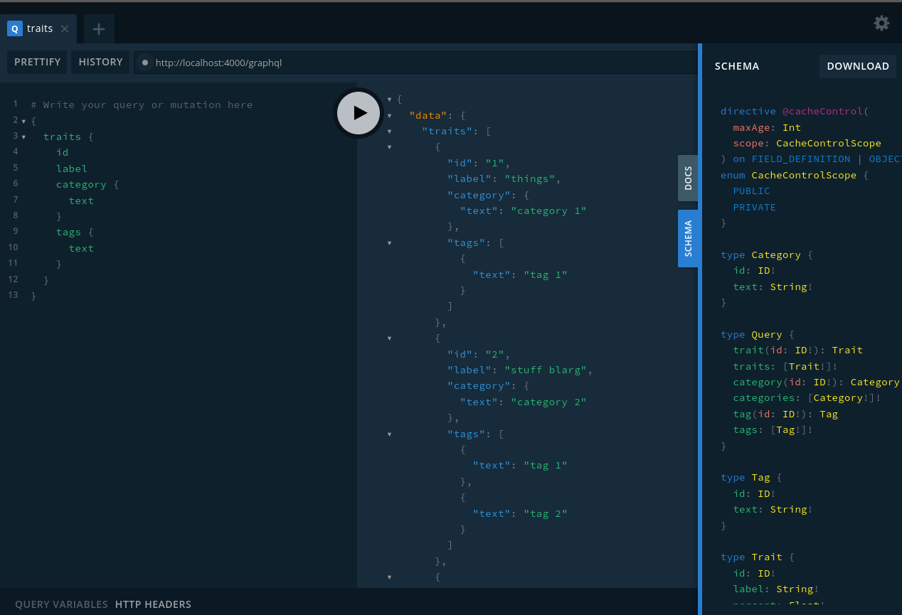
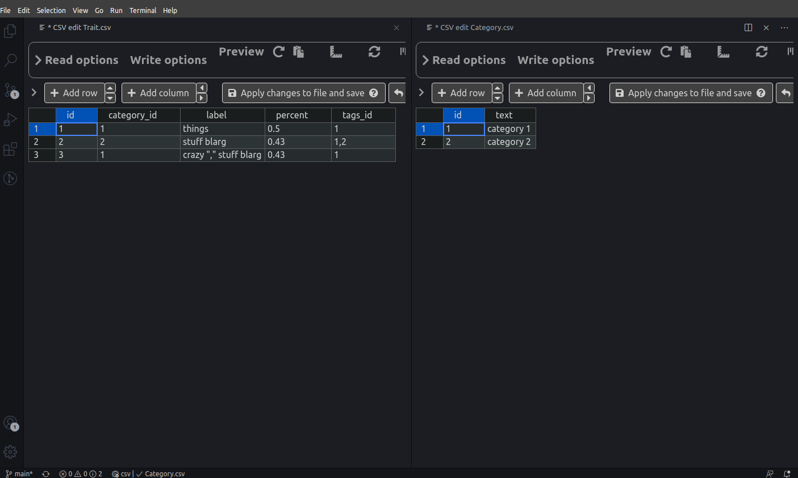

# GraphQL Spiker

GraphQL Spiker is an application that provides a GraphQL server backed by local CSV files. This is useful when you want to play around with schemas you are designing or to mock a service that isn't done yet.

It could also be used for proof of concept ideas, or super small internal services.

## How it Works

1. Define a schema in a sub-directory in the repository directory: `schema.graphql`
1. Create CSV files in the same directory with the name of the Types you define in the schema. Case matters, use uppercase object names. Meaning:

```
type Category ---> Category.csv
```

### Basic Object

The column names in the CSV should match the property names of the class. For example the following graphql object:

```gql
type Trait {
  id: ID!
  label: String!
  percent: Float!
}
```

Could be backed by the following CSV:

```csv
"id","label","percent"
"1","things","0.5"
```

### Query Section

You can link items in the query section using the `@spiker` directive. Using the directive you specify which "table" (aka file) the query is supposed to run against. The parameters passed will be assumed to be columns on that table / object. Here are some examples:

```gql
type Query {
  trait(id: ID!): Trait @spiker(table: "Trait")
  traits: [Trait!]! @spiker(table: "Trait")
  categories: [Category!]! @spiker(table: "Category")
  traitsByCategory(category_id: String!): [Trait!]! @spiker(table: "Trait")
  categoryByText(text: String!): [Category] @spiker(table: "Category")
}
```

Here are some example queries that use the schema above.

```gql
{
  trait(id: "1") {
    id
  }
  traits {
    id
    category {
      text
    }
    tags {
      id
    }
  }
  categoryByText(text: "category 1") {
    id
  }
}
```

For reference, the inject directive is:

`directive @spiker(table: String, field: String) on FIELD_DEFINITION`

### One to One

For a one-to-one relationship, define the graphql schema as you would:

```gql
type Category {
  id: ID!
  text: String!
}

type Trait {
  id: ID!
  label: String!
  percent: Float!
  category: Category
}
```

Then in the CSV add a column with the name of the related object with "\_id" after the column name:

```csv
(Trait.csv)
"id","category_id","label","percent"
"1","1","things","0.5"
"2","2","stuff blarg","0.43"

(Category.csv)
"id","text"
"1","category 1"
"2","category 2"
```

### One to Many

For one to many, define the relationship as you would in graphql schema:

```gql
type Tag {
  id: ID!
  text: String!
}

type Trait {
  id: ID!
  label: String!
  percent: Float!
  tags: [Tag]
}
```

Then in the CSV you add a column with the plural version of the related object with "\_id" after the column name. For example:

```csv
(Trait.csv)
"id","label","percent","tags_id"
"1","things","0.5","1"
"2","stuff blarg","0.43","1,2"

(Tag.csv)
"id","text"
"1","tag 1"
"2","tag 2"
```

Note to link many items, the column value is a comma separated list of external IDs.

---



